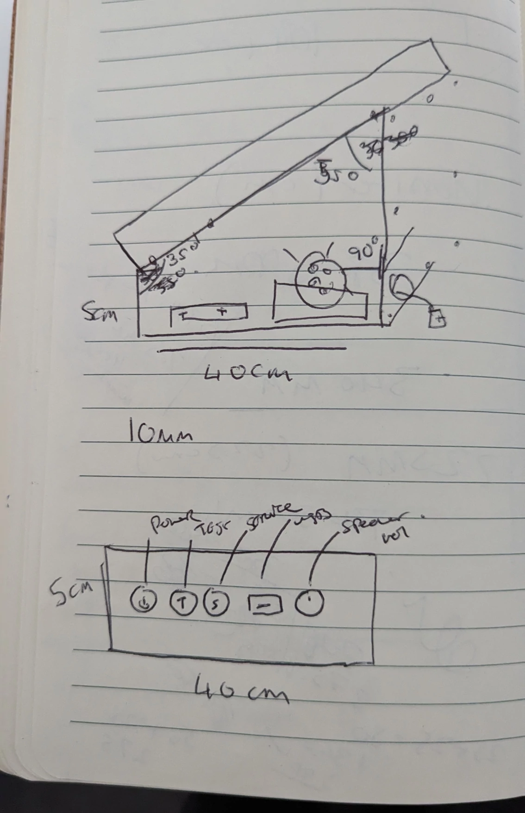
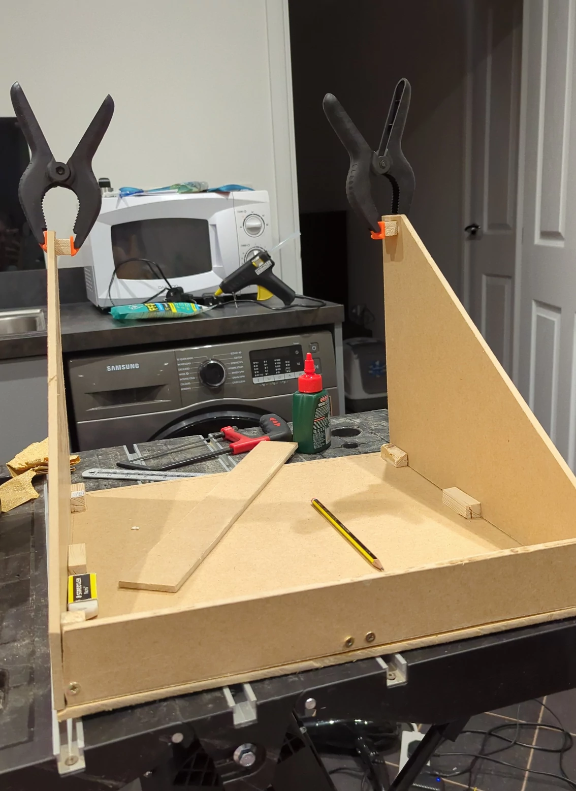
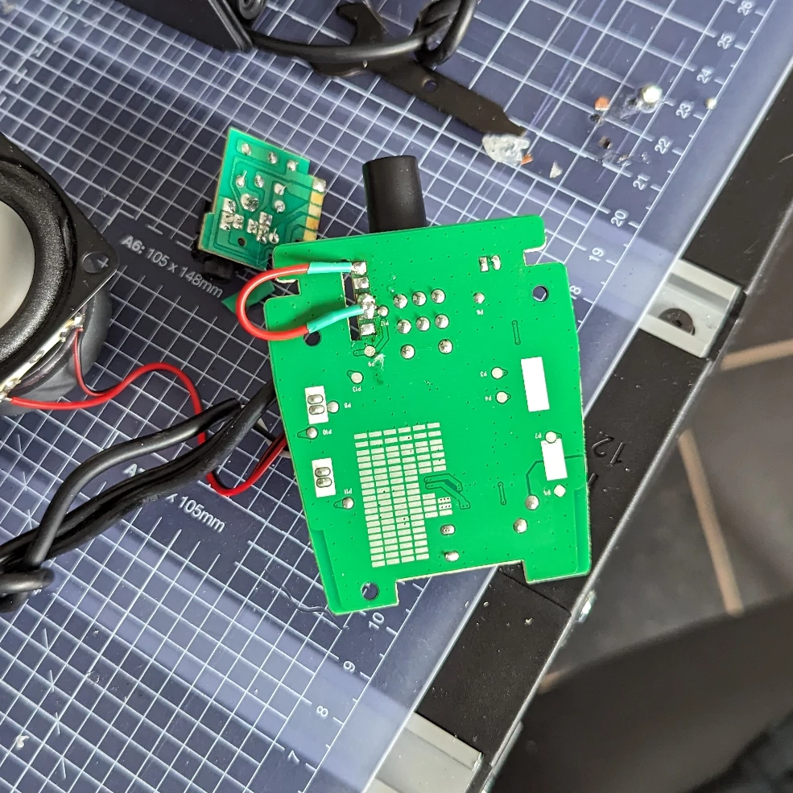
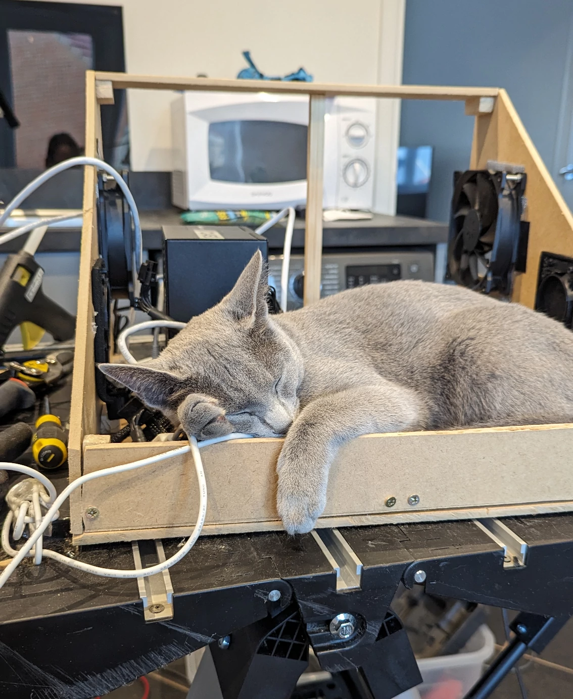
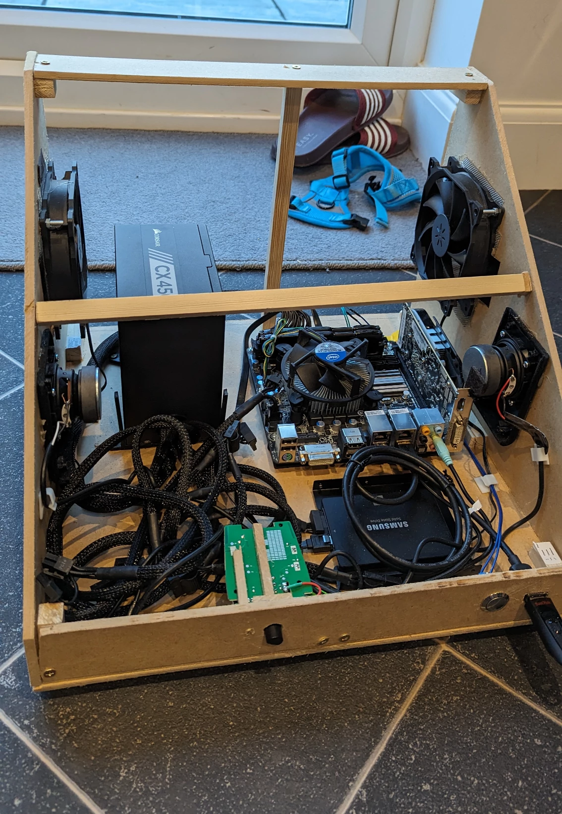
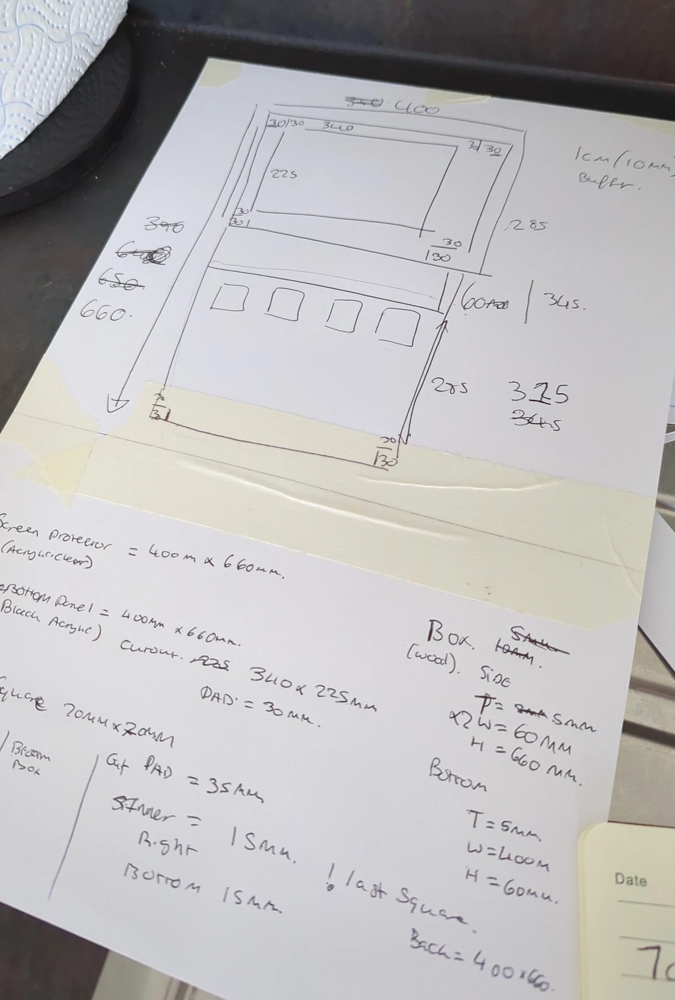
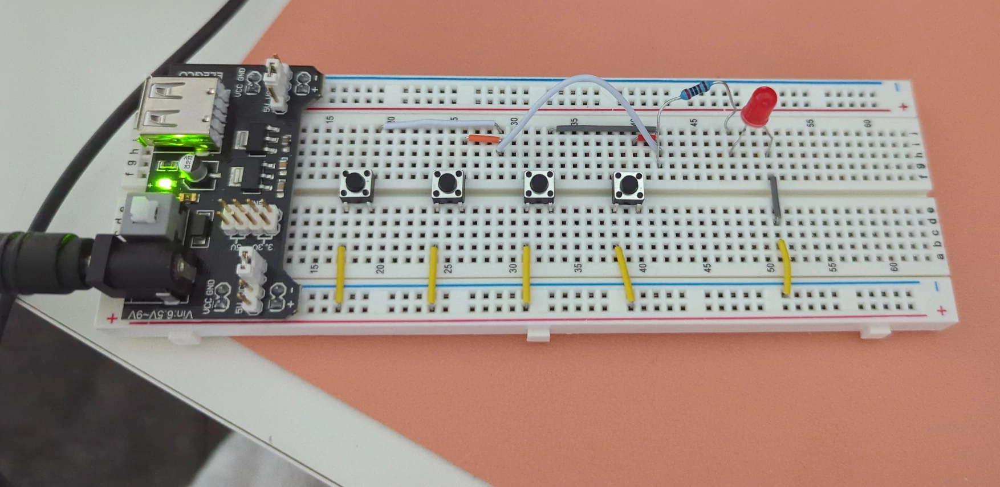

The build process took around 4 weeks, this wasn't constant working but a few hours each night after work and a few weekends. I had a few nights and a weekend off due to burn out but 4 weeks was the rough completion time.

This post will be split into 3 sections:
- [Building of the base unit](#buildingofthebaseunit)
- [Building of the controller](#buildingofthecontroller)
- [Cabinet Assembly](#assembly)

Building the base will include the process of designing and planning out the base of the arcade machine include the PC to run the software. Building the controller will be how I designed the top panel that would control the game.

### Building of the base unit
The main purpose of the base was to hold the main pc components, provide the viewing angle for the controller and most importantly hold the controller. I wanted the controller to be detachable so if I was to make a version 2 or do upgrades I could take it apart easily.

The drawing of the base was simple, an angled box that would have a speaker on each side with the front of the box having the various buttons and speaker controls.

Most of the base I could visualise how'd it look, however the measurements of the side panel I struggled with, for this I used [FreeCAD](https://www.freecad.org/) to make a mock-up technical drawing. I then created some software to cut up the exported drawing into A4 sheets of paper which I printed and stitched together to create a template I later on used to cut the side panels.

The initial base was held together with wood glue and screws, once the base was complete I could start to assemble the PC and other electronics inside of it. Jubeat being a rhythm game has music, so most importantly we were going to need speakers.

I bought some Amazon choice speakers, however these were too long and needed disassembling to fit to my requirements. As mentioned I haven't really ever done electronics, all I had built in the past is a LED lamp and in the process of tearing these speakers apart I broke something, the left speaker wasn't working. It was to do with the headphone jack that can be used to re-route the audio from the speakers.

I decided after a few hours of trying to solder and getting it to work it was best to scrap the headphone jack and I crudely wired a jumper cable in hopes it'd work and to my surprise it did, I then made some more crude decisions and managed to somehow get 2 working speakers fitted inside the base unit.

After the speakers I started to assemble the computer that would run the whole operation, I wanted a close to real Jubeat cabinet so I chose to use Windows 7 as my operating system. Windows 7 was discontinued in 2020 which made it quite difficult to get up and running, after a long phone call with the automated microsoft line and a few manual windows updates we were up and running and the base of the cabinet was complete and more importantly cat approved.

The final base ended up having extra supports, computer fans and a bit better cable management but overall not to different from the original drawing. The PC specs are:
- Windows 7
- i3 CPU
- 16GB DDR3 RAM
- 500gb SSD
- 500W PSU
Some of these parts I had lying around and parts like the motherboard and RAM I needed to order.

### Building of the controller
The controller is the most important part of this project, this is the piece of the puzzle that allows me to play the game. After my research I knew I was creating a input device like a keyboard for this I bought an Ardiuno leonardo which can emulate HID keyboard. I started by drawing once again a sketch on paper:

_Note don't follow these measurements as some of them ended up being wrong!_

Once I had a rough mock-up I once again used [FreeCAD](https://www.freecad.org/) to create a technical drawing which I then sent to a company to be laser cut out of acrylic as I would have not been able to had cut this out by hand. I then also designed the button mechanism, I wanted four buttons that would trigger as one input if any of them had been pressed then on-top of this bed of buttons would be an acrylic button.

One problem, how was I going to wire these buttons with minimal electronic experience? I bought an small electronic kit and just experimented with some help from online:

<iframe style="width: 75%; aspect-ratio: 16 / 9;" src="https://apps.jakeking.co.uk/galleria/api/render/wdgMkMNqfA"></iframe>

_Gallery of images during the build process of the controller will only show on desktop for now_

### Assembly
Once the two parts were built it was time to put both the base and controller together.

<iframe style="width: 75%; aspect-ratio: 16 / 9;" class="c-gallery" src="https://apps.jakeking.co.uk/galleria/api/render/LzJeUm5W30"></iframe>
_Gallery of images showing the assembly of the cabinet will only show on desktop for now_

I attached the top and bottom together using long threaded bolts, this allows me to disconnect the controller "easily" if needed. After this I tested the cabinet out and some of the buttons aren't the best and sometimes get stuck but it works well enough for a first version (See footnotes on what version 2 would look like), I am really happy with how it turned out, as I keep mentioning I had very basic skills in many areas before starting this project and this project has enhanced those skills and I have a few more ideas in my head on future projects which I will definitely do write ups on.

### The series:
- [Introduction](.)
- [Initial Research](./initial-research)
- [Costings](./costings)
- <ins>Build process</ins>
- [Footnotes](./footnotes)
