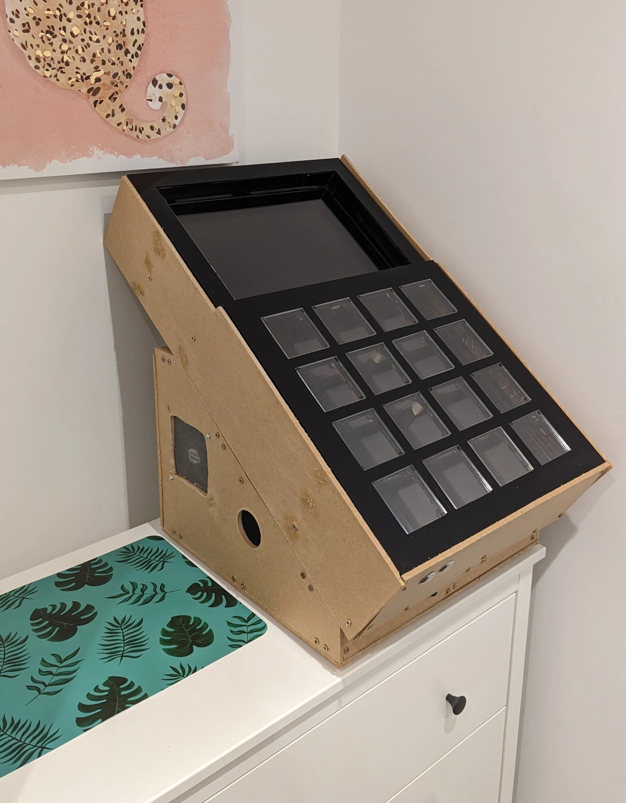

A friend of mine invited me to an arcade here in the UK, I'd never been before so I wasn't sure what to expect, the arcades I'd been too in the past were ones on situated by the seaside with crane games and slot machines but this arcade was different, one entry fee and a bunch of different arcade games to play for "free" once the entry price had been paid. The arcade was set out in three floors, first floor: rhythm, driving, shooter cabinets; second floor: old school cabinets and third floor pc and VR.

It was overwhelming at first, besides the bottom floor cabinets were mostly japanese origin so I couldn't read any of the text on screen and had to fumble may way through however there was one cabinet that caught my eye [Jubeat](https://en.wikipedia.org/wiki/Jubeat). This cabinet is a 4x4 grid of buttons that have to be pressed in time with the music to gain a score, the better the timing the higher the score. This hit a dopamine in my brain as it reminded me of old launchpad [videos](https://www.youtube.com/results?search_query=launchpad+cover) i'd watch when I was younger. I wanted one!

This blog series will document the process I went through of building my own Jubeat controller, this is not a tutorial but could be used as inspiration if you want to build your own. I will also not be mentioning anything around the software of Jubeat just the cabinet I built. For the purposes of this article I used software that emulates Jubeat and a better blog post on that can be found [here](https://davidobot.net/2020/05/03/jubeat-pc).

### The series breakdown:
- <ins>Introduction</ins>
- [Initial Research](./initial-research)
- [Costings](./costings)
- [Build process](./build-process)
- [Footnotes](./footnotes)

### TLDR
Here is the look of the final cabinet, it can use future improvements like a coat of paint but it's working and that is all that matters.

